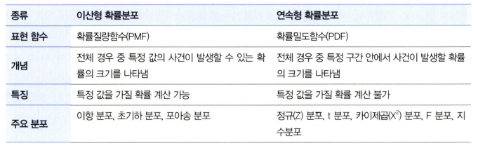
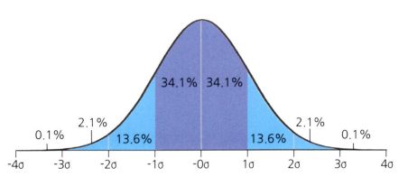
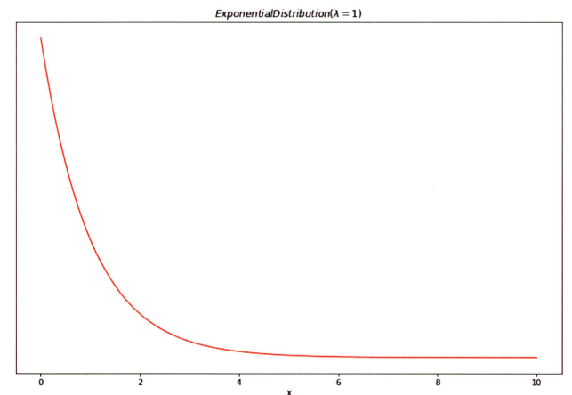
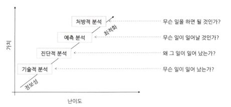

# 통계학 1주차 정규과제

📌통계학 정규과제는 매주 정해진 분량의 『*데이터 분석가가 반드시 알아야 할 모든 것*』 을 읽고 학습하는 것입니다. 이번 주는 아래의 **Statistics_1st_TIL**에 나열된 분량을 읽고 `학습 목표`에 맞게 공부하시면 됩니다.

아래의 문제를 풀어보며 학습 내용을 점검하세요. 문제를 해결하는 과정에서 개념을 스스로 정리하고, 필요한 경우 추가자료와 교재를 다시 참고하여 보완하는 것이 좋습니다.

1주차는 `1부. 데이터 기초체력 기르기`를 읽고 새롭게 배운 내용을 정리해주시면 됩니다.


## Statistics_1st_TIL

### 1부. 데이터 기초체력 기르기
### 01. 통계학 이해하기
### 02. 모집단과 표본추출
### 03. 변수와 척도
### 04. 데이터의 기술 통계적 측정
### 05. 확률과 확률변수
### 06. 확률분포
### 07. 가설검정

## Study Schedule

|주차 | 공부 범위     | 완료 여부 |
|----|--------------|----------|
|1주차| 1부 ~p.79    | ✅      |
|2주차| 2부 ~p.120   | 🍽️      | 
|3주차| 2부 ~p.202   | 🍽️      | 
|4주차| 2부 ~p.299   | 🍽️      | 
|5주차| 3부 ~p.356   | 🍽️      | 
|6주차| 3부 ~p.437   | 🍽️      | 
|7주차| 3부 ~p.542   | 🍽️      | 
|8주차| 3부 ~p.615   | 🍽️      | 
|9주차|데이터 분석 실습| 🍽️      |

<!-- 여기까진 그대로 둬 주세요-->

# 01. 통계학 이해하기

```
✅ 학습 목표 :
* 통계학의 필요성을 안다.
* 기술통계와 추론통계의 특성을 구분하여 이해한다.
```
<!-- 새롭게 배운 내용을 자유롭게 정리해주세요.-->

- 머신러닝과 전통적 통계학의 차이

    ```
    통계학의 주된 목적은 해석(explanation)

    머신러닝의 주된 목적은 예측(Prediction)

    : 때문에 분석 모형의 복잡성(complexity)이 높으며, 고질적인 문제인 과적합(overfitting) 해결에 집중
    ```

- 기술 통계
    ```
    주어진 데이터의 특성을 사실에 근거하여 설명하고 묘사하는 것
    ```

- 추론 통계
    ```
    표본 집단으로부터 모집단의 특성을 추론
    ```

# 02. 모집단과 표본추출

```
✅ 학습 목표 :
* 모집단과 표본, 모수와 통계량의 정의와 관계를 설명할 수 있다.
* 분석가가 비논리적인 추론을 내리는 패턴인 인지적 편향의 종류를 이해한다.
* 편향과 분산의 차이를 이해한다.
```

<!-- 새롭게 배운 내용을 자유롭게 정리해주세요.-->


- 표본조사를 하는 이유와 데이터과학 적용 방법
    ```
    최종 분석에는 전체 데이터를 사용하더라도, 
    분석 모델이 완성될 때까지는 표본 데이터를 활용하는 것이 경제적, 시간적으로 유리

    - 일반적으로 최소 200개 이상의 표본이 확보되면 분석이 가능
    (변수의 개수나 표본분산에 따라 더 많은 표본이 필요할 수 있음)

    - 변수 하나당 최소 30개의 관측치가 필요함
    ```

- 인지적 편향(Cognitive bias)
    ```
    분석가의 성향이나 상황에 따라 비논리적인 추론을 내리는 패턴
    ```

- 인지적 편향의 종류
    ```
    1. 확증 편향(confirmation bias)
    : 자신이 본래 믿고 있는 대로 정보를 선택적으로 받아들이고 임의로 판단하는 편향

    ex. 자신의 판단에 대한 확신을 더해주는 방향으로만 데이터를 조정

    2. 기준점 편향(anchoring bias)
    : 분석가가 가장 처음에 접하는 정보에 지나치게 매몰되는 편향

    ex. 처음으로 제안받는 금액이 협상의 기준점으로 자리 잡아, 그 범위 내에서 연봉을 협상하는 것

    3. 선택 지원 편향(choice-supportive bias)
    : 본인이 의사결정을 내리는 순간 그 선택의 긍정적인 부분에 대해 더 많이 생각하고 그 결정에 반대되는 증거를 무시하게 되는 편향

    **확증편향과의 차이**

    - 확증편향은 기존의 상식과 고정관념으로 정보와 근거들을 선택적으로 수용
    - 선택 지원 편향은 주어진 정보들을 통해 의사결정이 이루어진 순간부터 편향성을 가짐짐

    4. 분모 편향(denominator bias)
    : 분수 전체가 아닌 분자에만 집중하여 현황을 왜곡하
    여 판단하게 되는 편향

    5. 생존자 편향(survivorship bias)
    : 소수의 성공한 사례를 일반화된 것으로 인식함으로
    써 나타나는 편향

    ex. 이미 선택 과정을 통해 필터링된 일부의 정보만으로 잘못된 판단을 내리는 것
    ```

- 머신러닝 모델 측면의 편향과 분산
    ```
    편향
    : 예측값들이 정답과 일정하게 차이가 나는 정도를 의미 

    분산
    : 주어진 데이터 포인트 (예를 들어 평균)에 대한 모델 예측의 가변성을 뜻함

    편향과 분산은 Trade-off 관계이므로
    둘 간의 균형을 잘 맞춰 상황에 맞는 최적의 모델을 만드는 것이 중요!
    ```

# 03. 변수와 척도
```
✅ 학습 목표 :
* 독립변수, 종속변수에 대해 이해한다.
* 척도(변수의 데이터적 속성)의 종류를 알아본다.
* 척도에 따라 어떤 분석방법이 적절한지 판단할 수 있다.
```
<!-- 새롭게 배운 내용을 자유롭게 정리해주세요.-->

- 독립변수와 종속변수의 당야한 표현

    

- 척도의 종류

    

- 척도의 종류에 따른 포함 정보의 차이

    

- 변수의 척도에 따른 분석 방법

    

# 04. 데이터의 기술 통계적 측정

```
✅ 학습 목표 :
* 산포도의 의미와 산포도를 측정하는 방법에 대해 설명할 수 있다.
* 정규분포의 왜도값과 첨도값이 얼마인지 답할 수 있다.
```

<!-- 새롭게 배운 내용을 자유롭게 정리해주세요.-->

- 평균의 종류
    ```
    1. 산술평균(arithmetic mean)
    : 기본적인 평균 측정 방법

    2. 가중평균(weighted mean)
    : 더 많은 비중을 차지하는 집단에 가중치를 더해 합리적인 평균값을 구함

    3. 기하평균(geometric mean)
    :  일반적으로 시간에 따라 비율적으로 변화하는 값의 평균을 구함

    4. 조화평균(harmonic mean)
    : 시간적으로 변화하는 데이터에서 평균을 측정하는 방법

    **기하평균과의 차이**


    - 기하평균은 비율의 평균을 구함
    - 조화평균은 값의 평균을 구함
    ```

- 분포에 따른 평균, 중앙, 최빈값의 위치

    

- 분산과 표준편차
    ```
    분산과 표준편차는 데이터의 퍼진 정도를 파악할 수 있게 해주는 지표

    분산 
    : 제곱 값의 평균

    표준편차 
    : 분산에 제곱근 값을 구하여 실제 편차의 규모와 유사하게 조정한 것
    ```

- 산포도와 범위, 사분위수, 변동계수
    ```
    산포도(dispersion) = 분산도(variation)
    : 대푯값을 중심으로 자료들이 흩어져 있는 정도를 의미

    산포도를 측정하는 방법으로 범위, 분산, 표준편차, 사분위수 범위, 변동계수 등이 있음

    변동 계수(coefficient of variation, CV)
    : 표준편차를 산술평균으로 나누어 준 값

    두 자료의 평균이 다를 때, 표준편차만으로는 두 자료의 상대적인 데이터 산포 정도를 측정할 수가 없음

    하지만 변동 계수는 표준편차를 평균으로 나누어 다른 두 자료의 산포도를 비교할 수 있게됨
    ```

- 왜도(skewness)
    ```
    데이터 분포의 좌우 비대칭도를 표현하는 척도
    ```

- 왜도를 측정하는 방법

    

    ```
    피어슨의 비대칭 계수(Pearson's skewness coefficients)
    : 평균값, 중앙값, 최빈값 간의 차이를 비교한 후, 그 차이를 표준편차로 나눈 값을 통해 정도를 측정

    - 분포가 왼쪽으로 치우치고 오른쪽으로 긴 꼬리를 가지면 양수, 반대의 경우에는 음수를 가짐 

    - 보통 0보다 작거나 3보다 크면 데이터가 정규성을 가지지 않는다고 판단
    ```

- 왜도의 특징

    

- 첨도(kurtosis)
    ```
    분포가 정규분포보다 얼마나 뾰족하거나 완만한지의 정도를 나타내는 척도

    -  데이터가 중심에 많이 몰려 있을수록 뾰족한 모양이 되고, 두루 퍼지면 구릉 모양을 띔

    **분산과 표준편차와의 차이**

    - 분산과 표준편차는 데이터의 전반적인 산포경향을 나타냄
    - 첨도는 중심에 얼마나 집중적으로 쏠려 있는가를 나타냄
    ```

- 첨도의 특징

    

- 표준편차의 경험법칙

    
    ```
    1. 데이터의 약 68%는 평균으로부터 ±1 표준편차 이내에 속함
    2. 데이터의 약 95%는 평균으로부터 ±2 표준편차 이내에 속함
    3. 데이터의 약 99.7%는 평균으로부터 ±3 표준편차 이내에 속함

    - 경험법칙은 통계적으로 표본의 크기가 최소 100 이상은 되어야 성립

    체비셰프의 정리(Chebyshev's theorem)
    : 주어진 데이터가 정규분포가 아니거나 분포를 모를 경우에는 적용할 수 있음

    - 분포의 모양과 상관없이 평균값 ±2 표준편차 범위에 반드
    시 75% 이상의 데이터가 존재하고, ±3 범위에서는 적어도 89%, ±4 범위에서는 적어도 94%가 존재함함
    ```

# 05. 확률과 확률변수

```
✅ 학습 목표 :
* 베이즈 정리의 개념을 이해하고 이를 실생활 예제에 적용할 수 있다.
* 심슨의 역설을 경계하여 데이터를 분석할 때 세부 그룹별 패턴을 고려해 잘못된 결론을 방지할 수 있다.
```

<!-- 새롭게 배운 내용을 자유롭게 정리해주세요.-->

- 확률의 기본 개념
    ```
    일정한 조건 안에서 특정 사건이 일어날 수 있는 가능성의 정도

    ex.
    n 번의 시행 중 사건 A가 x번 일어났다면:

    사건 A가 일어날 확률 **P(A) = x / n**로 정의

    표본공간(sample space)
    : 통계적 실험을 통해 발생할 수 있는 모든 사건의 집합을 의미 (즉, 모든 경우의 수)

    표본 점(sample point) or 사건(event)
    : 한 번의 실험을 통해 발생할 수 있는 특정한 결과 혹은 표본공간의 부분집합을 뜻함

    ex.
    모집단 10개에서 3개를 표본으로 추출할 경우, 특정한 표본이 선택될 확률은?

    조합(combination)의 수식 :
    C = n! / r!(n-r)!
    ```

- 확률의 종류
    ```
    1. 비조건 확률(unconditional probability) or 한계확률(marginal probability)
    : 아무런 조건이 없는 상황에서 사건이 일어날 확률

    2. 결합확률(joint probability)
    : 두 개 이상의 사건이 동시에 일어나는 확률

    결합확률은 P(A∩B)로 표시하며, 사건의 교집합을 의미

    3. 조건부 확률(conditional probability)
    : 하나의 사건이 먼저 발생했다는 조건이 전제된 상황에서 또 다른 사건이 발생할 확률

    조건부확률은 동시에 발생하는 결합확률을 첫 번째 조건의 한계확률로 나눠 계산

    P(B | A)로 표현하며, 이 중 A가 먼저 전제되는 조건을 의미
    ```
    

- 분할
    ```
    사건들을 모두 합했을 때 전체 사건들을 포괄하되, 중복이 일어나지 않는 사건들의 집합을 뜻함

    ex.
    1. 주사위에서 짝수가 나오는 사건과 1이 나오는 사건만 고려한다면, 3과 5가 포함되지 못하므로 분할이 될 수 없음

    2. 홀수가 나오는 사건과 2 이상의 숫자가 나오는 사건은 3과 5가 중복되므로 역시 분할이 될 수 없음

    즉, 전체 수를 포함 & 중복 불가
    ```
    

- 베이지안 이론
    ```
    - P(A): A의 사전 확률
    - P(B): B의 사전 확률
    - P(B|A): 사건 A(원인)가 전제됐을 때 사건 B(결과)의 조건부확률(우도 확률, likelihood)
    - P(A|B): 사건 B(결과가 발생했다는 조건에서 사건 A(원인)가 발생했을 확률(사후 확률, posterior)

    베이지안 이론의 핵심 :

    "사건 발생 전에 이미 가지고 있는 사전확률 p(A)와 우도 확률 P(B|A)를 안다면 사후확률 P(A|B)를 계산할 수 있음"
    ```

- 베이지안 이론의 예시 1

    

    ```
    1. 배너 광고를 클릭하는 사람 중 남성의 비율은?
    2. 배너 광고를 클릭하는 사람 중 여성의 비율은?
    ```
    
    

- 베이지안 이론의 예시 2

    
    ```
    - 양성으로 진단받은 사람은 1,080(990+90)명
    - 양성 판정을 받고 실제로 병에 걸린 사람은 90명
    - 비율로 환산하면 약 8.3%(90/1080)다.
    ```

- 확률변수(random variable)의 개념
    ```
    확률변수
    : 측정 값이 변할 수 있는 확률이 주어진 변수를 의미
    
    ex. 표본평균, 표본분산( 표본추출을 어떻게 하는가에 따라 통계량이 달라지기 때문)

    확률 변수의 값은 표본공간이 크고 작음에 따라 특정 값이 나올 수 있는 확률이 달라짐
    ```
    

- 확률변수의 종류
    ```
    1. 이산확률변수
    : 변수가 가질 수 있는 값이 셀 수 있는 실숫값인 변수

    - 변수가 각 실숫값을 가질 수 있는 확률이 주어져 있음

    2. 연속확률변수

    : 변수가 가질 수 있는 값이 셀 수 있는 연속형 값인 변수
    
    - 나올 수 있는 값들의 개수를 셀 수가 없음
    - 가질 수 있는 값은 무한대(∞)이기 때문에 특정한 값을 가질 수 있는 확률은 0이라고 할 수 있음
    
    따라서 연속확률변수는 특정한 값이 아닌, 특정 구간이 나올 수 있는 확률을 구하는 식으로 접근해야 함
    ```
    

# 06. 확률분포

```
✅ 학습 목표 :
* 이산확률분포의 종류에 대해 알고, 각각의 특징과 활용 사례를 설명할 수 있다.
* 연속확률분포의 종류와 특징을 설명할 수 있다. 
* 중심극한정리(CLT)의 개념을 이해하고 설명 할 수 있다.
```

- 확률분포의 정의와 종류
    ```
    확률분포
    : 확률변수가 특정 값을 가질 확률을 나타낸 것
    
    이산확률분포(discrete probability distribution)
    :  확률변수가 가질 수 있는 값의 개수를 셀 수 있음

    ex.
    주사위를 던져서 나올 수 있는 경우의 수는 1에서 6까지로 셀 수 있으므로 이산확률분포를 갖음

    연속확률분포(continuous probability distribution)
    : 키, 시간과 같이 무한히 쪼갤 수 있는 분포를 의미하며 특정 구간 안에서 사건이 발생할 확률을 표현
    ```
    

[이산확률분포와 연속확률분포 추가자료](https://velog.io/@tngus0325/%EC%9D%B4%EC%82%B0%ED%99%95%EB%A5%A0-%EB%B6%84%ED%8F%AC%EC%99%80-%EC%97%B0%EC%86%8D%ED%99%95%EB%A5%A0-%EB%B6%84%ED%8F%AC-%EC%A0%95%EB%A6%AC)

## 6.2. 이산확률분포

> **🧚 이산확률분포에 대해 학습한 내용을 정리해주세요.**

<!--수식과 공식을 암기하기보다는 분포의 개념과 특성을 위주로 공부해주세요. 분석 대상의 데이터가 어떠한 확률분포의 특성을 가지고 있는지를 아는 것이 더 중요합니다.-->

- 이산확률분포

    ```
    1. 균등분포(uniform distribution)
    : X가 동일한 확률을 가지는 분포를 의미
    ```
    

    ```
    2. 이항분포(binomial distribution)
    : 동전의 앞뒤 혹은 성공/실패와 같이 1과 0의 값만을 갖는 분포를 의미

    베르누이 시행(Bernoulli trial)
    : 이항분포를 나타낼 수 있는, 결과가 두 가지 중 하나만 나오는 시행을 뜻함

    - 각각의 결과가 독립적으로 이루어지므로 처음에 0이 나왔다고 해서 다음에 나올 값에 영향을 주지 않음
    ```

    ```
    3. 초기하분포(hypergeometric distribution
    
    - 각 시행이 서로 독립적이지 않아서 시행마다 성공할 확률이 달라짐
    - 이항분포는 복원추출이지만 초기하분포는 비복원추출이기 때문
    ```

    ```
    4. 포아송분포(poisson distribution)
    : 일정한 관측 공간에서 특정 사건이 발생하는 횟수를 나타내는 이산확률분포

    - 성공과 실패, 즉 0과 1의 개념이 존재하지 않으며, 표본의 크기라는 개념 또한 존재하지 않음

    포아송분포가 가지는 조건 :
    - 발생하는 사건은 양의 정수 형태를 가짐
    - 모든 사건은 독립적으로 발생함
    - 해당 시공간에서 사건의 발생 비율은 항상 같음
    - 한 번에 둘 이상의 사건이 발생하지 않음
    ```

## 6.3. 연속확률분포

> **🧚 연속확률분포에 대해 학습한 내용을 정리해주세요.**

<!--수식과 공식을 암기하기보다는 분포의 개념과 특성을 위주로 공부해주세요. 분석 대상의 데이터가 어떠한 확률분포의 특성을 가지고 있는지를 아는 것이 더 중요합니다.-->

- 연속확률분포

    ```
    확률밀도함수(Probability Density Functions, PDF)
    :  확률변수 X가 가질 수 있는 값과 그에 대응하는 확률을 함수나 표, 그래프로 표현한 것

    연속형 확률분포는 확률밀도함수를 통해 전체 분포 중 특정 면적을 적분을 통해 분리하여 면적의 구간 안에서 사건이 발생할 확률을 계산
    ```

    ```
    1. 정규분포(normal distribution) or 가우스 분포(Gaussian distribution)
    ```

    

    ```
    2. 지수분포(exponential distribution)
    : 특정 사건이 발생한 시점으로부터 다음 사건이 발생할 때까지의 시간을 확률변숫값으로 하는 분포

    - 지수분포는 발생하는 사건 다음 사건이 일어날 때까지 대기 시간을 다룸

    -  표준정규분포처럼 절대적인 기준이 없고 평균에 따라 기울기가 정해짐
    ```
    


## 6.4. 중심극한정리

[중심극한정리 시뮬레이션](https://www.youtube.com/watch?v=aIPvgiXyBMI)

> **🧚 중심극한정리에 대해 학습한 내용을 정리해주세요.**

- 중심극한정리(Central Limit Theorem, CLT)

    ```
    데이터의 크기(n)가 일정한 양(ex. 30개)을 넘으면, 평균의 분포는 정규분포에 근사한다는 이론
    ```
    

# 07. 가설검정

```
✅ 학습 목표 :
* 귀무가설과 대립가설의 개념을 이해하고, 가설을 설정하는 원리를 설명할 수 있다.
* 가설검정의 유의수준과 p값의 의미를 이해하고, p값을 해석하여 귀무가설을 기각할지 여부를 판단할 수 있다.
* 1종 오류와 2종 오류의 차이를 설명하고, 실제 사례에서 어떤 오류를 더 중요하게 고려해야 하는지 분석할 수 있다.
```

<!-- 새롭게 배운 내용을 자유롭게 정리해주세요.-->

- 목적성에 따른 데이터 분석의 분류

    ```
    1. 기술적 분석(Descriptive Analytics)
    : 과거나 현재에 어떤 일이 일어났는지를 파악하기 위한 분석. 
    
    - 데이터의 분포, 추세 등을 분석하여 상황을 모니터링

    2. 진단적 분석(Diagnostic Analytics)
    : 과거나 현재에 발생한 사건의 원인을 밝히기 위한 분석
    
    - 데이터 간의 관계를 분석하여 인과관계를 찾음

    3. 예측 분석(Predictive Analytics)
    : 기계학습 모델 등을 사용하여, 미래에 어떤 일이 어느 정도의 확률로 일어날지를 예측
    
    - 현재는 알 수 없는 결과의 가능성을 파악
    
    4. 처방적 분석(Prescriptive Analytics)
    : 예측되는 미래의 결과를 위해 어떻게 하면 좋을지 처방하기 위한 분석
    
    - 제한된 자원을 효과적으로 활용하여 최적의 성과를 낼 수 있도록 방향을 도출
    ```
    

- 가설검정의 절차

    

    ```
    유의수준
    : 귀무가설이 맞거나 틀린 것을 판단하기 위한 통계값

    - 표본의 통계치가 귀무가설과 같이 나올 확률

    신뢰수준(Confidence level)
    : 유의수준과 반대되는 기준 

    - 유의수준이 0.05면 신뢰수준은 0.95로 둘을 합하면 100%가 됨

    가설검정은 귀무가설의 기각역을 어느 쪽으로 설정하는가에 따라 (1)왼쪽꼬리 검정, (2)오른쪽 꼬리 검정, 그리고 (3)양측 검정으로 구분됨

    ex.
    귀무가설 : A 마트의 일평균 고객이 1,000명이다
    대립가설 : 일평균 고객이 1,000명이 아니다

    : 양측검정

    ex.
    귀무가설 : A 마트의 일평균 고객이 1,000명 이상이다
    대립가설 : 일평균 고객이 1,000명 미만이다

    : 단측 검정

    즉, 가설이 '다르다(≠)'면 양측검정, '크다(>)'거나 '작다(<)'와 같이 한쪽만을 검정하는 경우 단측검정임

    양측검정보다는 단측 검정을 시행하는 것이 바람직함
    
    이유 : 양측검정은 통계량이 같지 않다는 것만 알 수 있는 반면, 단측 검정은 크거나 작은 방향성에 대한 정보가 포함되기 때문
    ```
    

- 1종 오류와 2종 오류

    ```
    1종 오류(Type I Error)
    : 귀무가설이 참임에도 불구하고 귀무가설을 기각하는 오류
    (실제로 효과가 없는데 효과가 있다고 판단)

    - 1종 오류를 줄이기 위해서는 유의수준의 기준 값을 더 낮추면 됨

    2종 오류(Type II Error)
    : 귀무가설이 거짓임에도 불구하고 귀무가설을 채택하는 오류
    (실제로 효과가 있는데 효과가 없다고 판단)

    -  가설검정의 검정력(power)이 커질수록 줄어들게 됨

    검정력
    : 귀무가설이 거짓일 때 귀무가설을 기각할 확률을 의미

    - 유의수준을 정함 = 검정력을 정함

    일반적으로 유의수준(α)은 0.05, 1-검정력(β)은 0.2 기준을 사용하며, 1종 오류를 2종 오류보다 더 중요하게 생각함
    ```
    


<br>
<br>

# 확인 문제

## 문제 1.

> **🧚 어떤 분석 방법이 적절할까요?**
<br>

> 🔍 **Q1. 연속형 변수 간 유사성을 기반으로 그룹을
나누고자 하는 경우**   
Ex1) 고객을 유사한 구매 패턴이나 성향을 가진
그룹으로 나누는 경우   
Ex2) 유사한 주제를 가진 문서들을 같은 그룹으로
분류하는 경우

```
Clustering
```

<br>

> 🔍 **Q2. 범주형 변수 간 인과관계를 확인하고자 하는 경우**   
Ex1) 광고 유형(A/B 테스트)과 고객 구매 여부 간의
관계를 분석하는 경우     
Ex2) 성별과 특정 질병 유무 간의 연관성을 분석
하는 경우

```
로지스틱 회귀
```

<br>

> 🔍 **Q3. 연속형 변수 간 인과관계가 존재하는 경우**   
Ex1) 광고비 지출과 매출 간의 관계를 분석하는 경우     
Ex2) 체중과 혈압 간의 관계를 분석하는 경우

```
회귀분석
```

## 문제 2.

> **🧚Q. (주)다트비의 조일 과장은 이커머스 플랫폼의 마케팅 업무를 담당하고 있다. 최근 회사에서는 배너 광고의 클릭률(CTR)이 기대보다 낮아 최적의 광고 타겟층을 선정하는 프로젝트를 진행 중이다. 조 과장은 광고 효과를 높이기 위해 고민하던 중, 사이트 방문자의 70%가 모바일 유저, 30%가 PC 유저라는 정보를 알아냈다. 그래서 모바일 유저를 타깃으로 배너 광고를 올리면 되겠다 생각했는데 알고 보니 PC 유저의 광고 클릭률(CTR)이 5%로, 모바일 유저의 광고 클릭률(CTR)보다 4%p 높았다. 이런 경우, 모바일과 PC 중 어느 유저층에 집중하여 배너 광고를 올리는 것이 더 효과적일까? (소수점 둘째자리까지 반올림하여 답해주세요.)**

> 💝 **Hint**   
-P(클릭)을 구한다.  
-P(모바일 유저|클릭)과 P(PC 유저|클릭)을 구하고 값을 비교한다.

<!-- 베이즈 정리를 이해하였는지 확인하기 위한 문제입니다. 문제의 답과 풀이를 작성해주세요. 힌트를 참고하셔도 좋습니다.-->

```
1. P(클릭) 
: = (0.0125 * 0.7 + 0.05 * 0.3) = 0.02375

2. P(모바일 유저|클릭) = P(클릭|모바일 유저) * P(모바일 유저) / P(클릭률)
: 0.0125 * 0.7 / 0.02375 ≒ 0.37

3. P(PC 유저|클릭) = P(클릭|PC 유저) * P(PC 유저) / P(클릭률)
: 0.05 * 0.3 / 0.02375 ≒ 0.63

0.63 > 0.37

따라서 PC 유저층에 집중하여 배너 광고를 올리는 것이 더 효과적임
```

## 문제 3.

> **🧚Q. 한 대형 병원이 두 명의 외과 의사(A와 B)의 수술 성공률을 비교하려고 한다. 과거 1년간의 데이터를 보면, A 의사의 전체 수술 성공률은 80%, B 의사의 전체 수술 성공률은 90%였다. 이 데이터를 본 병원 경영진은 A 의사의 실력이 B 의사보다 별로라고 판단하여 A 의사의 수술 기회를 줄이는 방향으로 정책을 조정하려 한다.
그러나 일부 의료진은 이 결론에 의문을 제기했다.
그들은 "단순한 전체 성공률이 아니라 더 세부적인 데이터를 분석해야 한다"고 주장했다.**

> **-A 의사의 실력이 실제로 B 의사보다 별로라고 결론짓는 것이 타당한가?   
-그렇지 않다면, 추가로 확인해야 할 정보는 무엇인가?**

<!-- 심슨의 역설을 이해하였는지 확인하기 위한 문제입니다-->

<!-- 정해진 답은 없습니다. 자유롭게 작성해주세요-->

```
타당하지 않음

전체 수술 건수, 수술 난도 등 여러 면의 복합적인 작용으로 성공 확률에 차이가 발생했을 수 있음

때문에 보다 정확하게 실력을 평가하기 위해선 수술과 관련된 세부적인 자료를 살펴봐야 함 
```

## 문제 4. 

> **🧚 OX 문제입니다.**

> **다음 명제가 유의수준 5%를 설정한 것과 동일한 의미인지 판단하세요.   
1️⃣ 표본이 귀무가설과 같을 확률이 5% 미만이다.   
2️⃣ 귀무가설이 참일 확률이 5%이다.   
3️⃣ 귀무가설이 참일 때, 극단적인 표본이 나올 확률을 5%로 설정한 것이다.**

<!-- 동일하면 O, 동일하지 않으면 X.-->

```
1️⃣ : X
2️⃣ : X
3️⃣ : O
```

## 문제 5.

> **🧚Q. 다음 중 귀무가설(H₀)을 기각해야 하는 경우는 언제인가요? 정답을 고르고, 그 이유를 간단히 설명해주세요.**

> **1️⃣ 유의수준(α)이 0.05이고, p값이 0.03일 때   
2️⃣ 유의수준(α)이 0.01이고, p값이 0.02일 때**

```
정답 : 1️⃣

이유 : p값이 유의수준인 0.05보다 낮음으로 기각역에 속해 귀무가설을 기각할 수 있음음
```

### 🎉 수고하셨습니다.