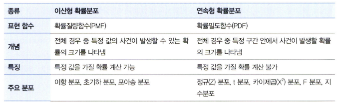
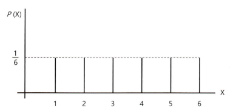
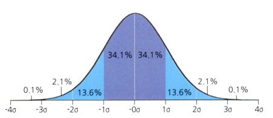
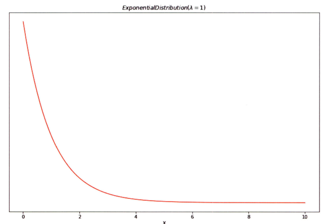
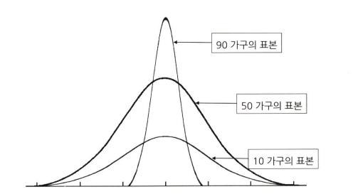
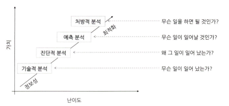
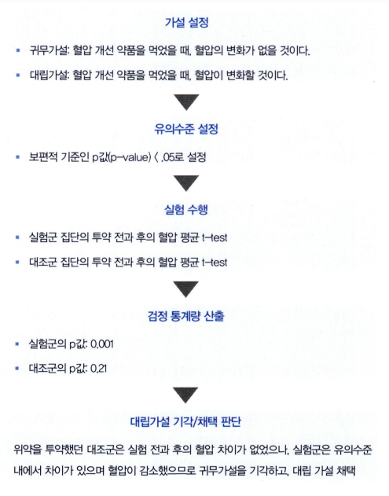
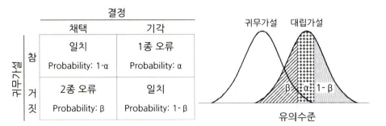

# 통계학 2주차 정규과제

📌통계학 정규과제는 매주 정해진 분량의 『*데이터 분석가가 반드시 알아야 할 모든 것*』 을 읽고 학습하는 것입니다. 이번 주는 아래의 **Statistics_2nd_TIL**에 나열된 분량을 읽고 `학습 목표`에 맞게 공부하시면 됩니다.

아래의 문제를 풀어보며 학습 내용을 점검하세요. 문제를 해결하는 과정에서 개념을 스스로 정리하고, 필요한 경우 추가자료와 교재를 다시 참고하여 보완하는 것이 좋습니다.

2주차는 `1부. 데이터 기초체력 기르기`를 읽고 새롭게 배운 내용을 정리해주시면 됩니다.


## Statistics_2nd_TIL

### 1부. 데이터 기초체력 기르기
### 06. 확률분포
### 07. 가설검정

## Study Schedule

|주차 | 공부 범위     | 완료 여부 |
|----|----------------|----------|
|1주차| 1부 p.2~56     | ✅      |
|2주차| 1부 p.57~79    | ✅      | 
|3주차| 2부 p.82~120   | 🍽️      | 
|4주차| 2부 p.121~202  | 🍽️      | 
|5주차| 2부 p.203~254  | 🍽️      | 
|6주차| 3부 p.300~356  | 🍽️      | 
|7주차| 3부 p.357~615  | 🍽️      |

<!-- 여기까진 그대로 둬 주세요-->

# 06. 확률분포

```
✅ 학습 목표 :
* 이산확률분포의 종류와 특징을 설명할 수 있다.
* 연속확률분포의 종류와 특징을 설명할 수 있다. 
* 중심극한정리(CLT)의 개념을 이해하고 설명 할 수 있다.
```

[이산확률분포와 연속확률분포 추가자료](https://velog.io/@tngus0325/%EC%9D%B4%EC%82%B0%ED%99%95%EB%A5%A0-%EB%B6%84%ED%8F%AC%EC%99%80-%EC%97%B0%EC%86%8D%ED%99%95%EB%A5%A0-%EB%B6%84%ED%8F%AC-%EC%A0%95%EB%A6%AC)

- 확률분포의 정의와 종류
    ```
    확률분포
    : 확률변수가 특정 값을 가질 확률을 나타낸 것
    
    이산확률분포(discrete probability distribution)
    :  확률변수가 가질 수 있는 값의 개수를 셀 수 있음

    ex.
    주사위를 던져서 나올 수 있는 경우의 수는 1에서 6까지로 셀 수 있으므로 이산확률분포를 갖음

    연속확률분포(continuous probability distribution)
    : 키, 시간과 같이 무한히 쪼갤 수 있는 분포를 의미하며 특정 구간 안에서 사건이 발생할 확률을 표현
    ```
    

## 6.2. 이산확률분포

> **🧚 이산확률분포에 대해 학습한 내용을 정리해주세요.**

<!--수식과 공식을 암기하기보다는 분포의 개념과 특성을 위주로 공부해주세요. 분석 대상의 데이터가 어떠한 확률분포의 특성을 가지고 있는지를 아는 것이 더 중요합니다.-->

- 이산확률분포

    ```
    1. 균등분포(uniform distribution)
    : X가 동일한 확률을 가지는 분포를 의미
    ```
    

    ```
    2. 이항분포(binomial distribution)
    : 동전의 앞뒤 혹은 성공/실패와 같이 1과 0의 값만을 갖는 분포를 의미

    베르누이 시행(Bernoulli trial)
    : 이항분포를 나타낼 수 있는, 결과가 두 가지 중 하나만 나오는 시행을 뜻함

    - 각각의 결과가 독립적으로 이루어지므로 처음에 0이 나왔다고 해서 다음에 나올 값에 영향을 주지 않음
    ```

    ```
    3. 초기하분포(hypergeometric distribution)
    
    - 각 시행이 서로 독립적이지 않아서 시행마다 성공할 확률이 달라짐
    - 이항분포는 복원추출이지만 초기하분포는 비복원추출이기 때문
    ```

    ```
    4. 포아송분포(poisson distribution)
    : 일정한 관측 공간에서 특정 사건이 발생하는 횟수를 나타내는 이산확률분포

    - 성공과 실패, 즉 0과 1의 개념이 존재하지 않으며, 표본의 크기라는 개념 또한 존재하지 않음

    포아송분포가 가지는 조건 :
    - 발생하는 사건은 양의 정수 형태를 가짐
    - 모든 사건은 독립적으로 발생함
    - 해당 시공간에서 사건의 발생 비율은 항상 같음
    - 한 번에 둘 이상의 사건이 발생하지 않음
    ```

## 6.3. 연속확률분포

> **🧚 연속확률분포에 대해 학습한 내용을 정리해주세요.**

<!--수식과 공식을 암기하기보다는 분포의 개념과 특성을 위주로 공부해주세요. 분석 대상의 데이터가 어떠한 확률분포의 특성을 가지고 있는지를 아는 것이 더 중요합니다.-->

- 연속확률분포

    ```
    확률밀도함수(Probability Density Functions, PDF)
    :  확률변수 X가 가질 수 있는 값과 그에 대응하는 확률을 함수나 표, 그래프로 표현한 것

    연속형 확률분포는 확률밀도함수를 통해 전체 분포 중 특정 면적을 적분을 통해 분리하여 면적의 구간 안에서 사건이 발생할 확률을 계산
    ```

    ```
    1. 정규분포(normal distribution) or 가우스 분포(Gaussian distribution)
    ```

    

    ```
    2. 지수분포(exponential distribution)
    : 특정 사건이 발생한 시점으로부터 다음 사건이 발생할 때까지의 시간을 확률변숫값으로 하는 분포

    - 지수분포는 발생하는 사건 다음 사건이 일어날 때까지 대기 시간을 다룸

    -  표준정규분포처럼 절대적인 기준이 없고 평균에 따라 기울기가 정해짐
    ```
    

## 6.4. 중심극한정리

[중심극한정리 시뮬레이션](https://www.youtube.com/watch?v=aIPvgiXyBMI)

> **🧚 중심극한정리에 대해 학습한 내용을 정리해주세요.**

- 중심극한정리(Central Limit Theorem, CLT)

    ```
    데이터의 크기(n)가 일정한 양(ex. 30개)을 넘으면, 평균의 분포는 정규분포에 근사한다는 이론
    ```
    

# 07. 가설검정

```
✅ 학습 목표 :
* 귀무가설과 대립가설의 개념을 정의하고, 주어진 연구 질문에 적절한 가설을 설정할 수 있다.
* 가설검정의 유의수준과 p값의 개념을 설명하고, p값을 해석하여 귀무가설을 기각할지 여부를 판단할 수 있다.
* 1종 오류와 2종 오류의 차이를 설명하고, 실제 사례에서 어떤 오류를 더 중요하게 고려해야 하는지 판별할 수 있다.
```

<!-- 새롭게 배운 내용을 자유롭게 정리해주세요.-->

- 목적성에 따른 데이터 분석의 분류

    ```
    1. 기술적 분석(Descriptive Analytics)
    : 과거나 현재에 어떤 일이 일어났는지를 파악하기 위한 분석. 
    
    - 데이터의 분포, 추세 등을 분석하여 상황을 모니터링

    2. 진단적 분석(Diagnostic Analytics)
    : 과거나 현재에 발생한 사건의 원인을 밝히기 위한 분석
    
    - 데이터 간의 관계를 분석하여 인과관계를 찾음

    3. 예측 분석(Predictive Analytics)
    : 기계학습 모델 등을 사용하여, 미래에 어떤 일이 어느 정도의 확률로 일어날지를 예측
    
    - 현재는 알 수 없는 결과의 가능성을 파악
    
    4. 처방적 분석(Prescriptive Analytics)
    : 예측되는 미래의 결과를 위해 어떻게 하면 좋을지 처방하기 위한 분석
    
    - 제한된 자원을 효과적으로 활용하여 최적의 성과를 낼 수 있도록 방향을 도출
    ```
    

- 가설검정의 절차

    

    ```
    유의수준
    : 귀무가설이 맞거나 틀린 것을 판단하기 위한 통계값

    - 표본의 통계치가 귀무가설과 같이 나올 확률

    신뢰수준(Confidence level)
    : 유의수준과 반대되는 기준 

    - 유의수준이 0.05면 신뢰수준은 0.95로 둘을 합하면 100%가 됨

    가설검정은 귀무가설의 기각역을 어느 쪽으로 설정하는가에 따라 (1)왼쪽꼬리 검정, (2)오른쪽 꼬리 검정, 그리고 (3)양측 검정으로 구분됨

    ex.
    귀무가설 : A 마트의 일평균 고객이 1,000명이다
    대립가설 : 일평균 고객이 1,000명이 아니다

    : 양측검정

    ex.
    귀무가설 : A 마트의 일평균 고객이 1,000명 이상이다
    대립가설 : 일평균 고객이 1,000명 미만이다

    : 단측 검정

    즉, 가설이 '다르다(≠)'면 양측검정, '크다(>)'거나 '작다(<)'와 같이 한쪽만을 검정하는 경우 단측검정임

    양측검정보다는 단측 검정을 시행하는 것이 바람직함
    
    이유 : 양측검정은 통계량이 같지 않다는 것만 알 수 있는 반면, 단측 검정은 크거나 작은 방향성에 대한 정보가 포함되기 때문
    ```
    

- 1종 오류와 2종 오류

    ```
    1종 오류(Type I Error)
    : 귀무가설이 참임에도 불구하고 귀무가설을 기각하는 오류
    (실제로 효과가 없는데 효과가 있다고 판단)

    - 1종 오류를 줄이기 위해서는 유의수준의 기준 값을 더 낮추면 됨

    2종 오류(Type II Error)
    : 귀무가설이 거짓임에도 불구하고 귀무가설을 채택하는 오류
    (실제로 효과가 있는데 효과가 없다고 판단)

    -  가설검정의 검정력(power)이 커질수록 줄어들게 됨

    검정력
    : 귀무가설이 거짓일 때 귀무가설을 기각할 확률을 의미

    - 유의수준을 정함 = 검정력을 정함

    일반적으로 유의수준(α)은 0.05, 1-검정력(β)은 0.2 기준을 사용하며, 1종 오류를 2종 오류보다 더 중요하게 생각함
    ```
    

<br>
<br>

# 확인 문제

## 문제 1. 

> **🧚 OX 문제입니다.**

> **다음 명제가 유의수준 5%를 설정한 것과 동일한 의미인지 판단하세요.   
1️⃣ 표본이 귀무가설과 같을 확률이 5% 미만이다.   
2️⃣ 귀무가설이 참일 확률이 5%이다.   
3️⃣ 귀무가설이 참일 때, 극단적인 표본이 나올 확률을 5%로 설정한 것이다.**

<!-- 동일하면 O, 동일하지 않으면 X.-->

```
1️⃣: X
2️⃣: X
3️⃣: O
```

## 문제 2.

> **🧚Q. 다음 중 귀무가설(H₀)을 기각해야 하는 경우는 언제인가요? 정답을 고르고, 그 이유를 간단히 설명해주세요.**

> **1️⃣ 유의수준(α)이 0.05이고, p값이 0.03일 때   
2️⃣ 유의수준(α)이 0.01이고, p값이 0.02일 때**

```
정답: 1️⃣

이유: p값이 유의수준인 0.05보다 낮음으로 기각역에 속해 귀무가설을 기각할 수 있음
```

### 🎉 수고하셨습니다.