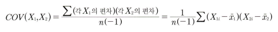

# 통계학 4주차 정규과제

📌통계학 정규과제는 매주 정해진 분량의 『*데이터 분석가가 반드시 알아야 할 모든 것*』 을 읽고 학습하는 것입니다. 이번 주는 아래의 **Statistics_4th_TIL**에 나열된 분량을 읽고 `학습 목표`에 맞게 공부하시면 됩니다.

아래의 문제를 풀어보며 학습 내용을 점검하세요. 문제를 해결하는 과정에서 개념을 스스로 정리하고, 필요한 경우 추가자료와 교재를 다시 참고하여 보완하는 것이 좋습니다.

4주차는 `2부. 데이터 분석 준비하기`를 읽고 새롭게 배운 내용을 정리해주시면 됩니다.

[실습코드](https://github.com/c-karl/DA_DS_Book001)를 참고하여 학습해주세요.


## Statistics_4th_TIL

### 2부. 데이터 분석 준비하기
### 10. 데이터 탐색과 시각화


## Study Schedule

|주차 | 공부 범위     | 완료 여부 |
|----|--------------|----------|
|1주차| 1부 ~p.56    | ✅      |
|2주차| 1부 ~p.79    | ✅      | 
|3주차| 2부 ~p.120   | ✅      | 
|4주차| 2부 ~p.202   | ✅      | 
|5주차| 2부 ~p.299   | 🍽️      | 
|6주차| 3부 ~p.437   | 🍽️      | 
|7주차| 3부 ~p.542   | 🍽️      | 
|8주차| 3부 ~p.615   | 🍽️      |

<!-- 여기까진 그대로 둬 주세요-->

# 10. 데이터 탐색과 시각화

```
✅ 학습 목표 :
* EDA의 목적을 설명할 수 있다.
* 주어진 데이터셋에서 이상치, 누락값, 분포 등을 식별하고 EDA 결과를 바탕으로 데이터셋의 특징을 해석할 수 있다.
* 공분산과 상관계수를 활용하여 두 변수 간의 관계를 해석할 수 있다.
* 적절한 시각화 기법을 선택하여 데이터의 특성을 효과적으로 전달할 수 있다.
```
<!-- 새롭게 배운 내용을 자유롭게 정리해주세요.-->

```
데이터를 올바르게 파악하고 효과적으로 가공하는 것이 가장 중요!
```

- 탐색적 데이터 분석(Exploratory Data Analysis; EDA)

    ```
    : 가공하지 않은 원천의 데이터를 있는 그대로 탐색하고 분석하는 기법

    EDA의 주요 목적:

    - 데이터의 형태와 척도가 분석에 알맞게 되어있는지 확인(sanity checking)
    - 데이터의 평균, 분산, 분포, 패턴 등의 확인을 통해 데이터 특성 파악
    - 데이터의 결측값이나 이상치 파악 및 보완
    - 변수 간의 관계성 파악
    - 분석 목적과 방향성 점검 및 보정
    ```

- 탐색적 데이터 분석 실습

    ```PYTHON
    # 각 컬럼의 왜도 확인

    df.skew()

    # 각 컬럼의 첨도 확인

    df.kurtosis()
    ```

- 공분산

    ```
    : 서로 공유하는 분산

    분산
    : 한 변수의 각각의 데이터가 퍼진 정도를 나타냄
    
    공분산
    : 두 분산의 관계를 뜻함

    공분산의 한계점:
    
    각 변수 간의 다른 척도기준이 그대로 반영되어 공분산 값이 지니는 크기가 상관성의 정도를 나타내지 못함
    
    ex. 
    X1과 X2의 공분산 값: 1300
    X3와 X4의 공분산 값: 800
    
    X1과 X2의 상관관계가 X3와 X4의 상관관계보다 크다고 할 수 없음

    ```
    

- 상관계수

    
    

    ```
    X1과 X2가 함께 변하는 정도(공분산)를 X1과 X2가 변하는 전체 정도로 나눠준 것

    - 산점도의 기울기와 상관계수는 관련X
    - 분산의 관계성이 같다면, 기울기가 크든 작든 상관계수는 같음
    
    결론적으로, 상관계수가 높다는 것은 X1이 움직일 때 X2가 많이 움직인다는 뜻이 아니라, X2를 예상할 수 있는 정확도, 즉 설명력이 높다는 것을 의미
    ```
    
    

- 시간 시각화

    ```
    : 시간 흐름에 따른 데이터의 변화를 표현

    -  데이터의 트렌드나 노이즈를 쉽게 파악할 수 있음

    시간 시각화 종류:

    1. 선그래프(연속형)
    2. 막대그래프(분절형)
    ```

    ```
    선그래프
    : 시간 간격의 밀도가 높을 때 사용

    - 데이터의 양이 너무 많거나 변동이 심하면 트렌드나 패턴을 확인하는 것이 어려움
    >> 추세선(가장 일반적인 방법은 이동평균(Moving average)법)을 삽입하여 들쭉날쭉한 데이터 흐름을 안정된 선으로 표현 가능
    ```
    
    
    ```
    막대그래프, 누적 막대그래프, 점 그래프
    : 월 간격 단위 흐름과 같이 시간의 밀도가 낮은 경우에 활용하기 좋음
    ```
    

- 관계 시각화

    ```
    산점도(scatter plot)
    
    - 극단치로 인해 주요 분포 구간이 압축되어 시각화의 효율이 떨어지기 때문에 산점도를 그릴 때는 극단치를 제거하고서 그리는 것이 좋음
    ```
    

- 공간 시각화

    ```
    : 위치 정보인 위도와 경도 데이터를 지도에 매핑하여 시각적으로 표현

    공간시각화의 대표적인 기법
    
    1. 도트맵

    : 지리적 위치에 동일한 크기의 작은 점을 찍어서 해당 지역의 데이터 분포나 패턴을 표현

    - 정확한 값을 전달하는 데에는 적합하지 않음

    2. 코로플레스맵

    : 데이터 값의 크기에 따라 색상의 음영을 달리하여 해당 지역에 대한 값을 시각화

    - 정확한 수치를 인지하고 비교하는 것이 어려움

    3. 버블맵

    : 버블차트를 지도에 그대로 옮겨 둔 것

    - 지나치게 큰 버블은 다른 지역의 버블과 영역이 겹칠 수 있기 때문에 이를 잘 조절해야 함

    4. 컨넥션맵 or 링크맵(Link map)

    : 지도에 찍힌 점들을 곡선 또는 직선으로 연결하여 지리적 관계를 표현

    - 지역 간의 무역관계나 항공 경로나 통신 정보 흐름 등을 표현할 때 사용
    ```
    


<br>
<br>

# 확인 문제

## 문제 1.
> **🧚 공분산과 상관계수의 차이점에 대해 간단히 설명하세요.**

```
공분산의 경우 각 변수 간의 다른 척도기준이 그대로 반영되어 값이 지니는 크기가 상관성의 정도를 나타내지 못하지만,
상관계수의 경우 공분산을 X1과 X2가 변하는 전체 정도로 나누어주어 절대적인 기준을 가짐
```

## 문제 2.
> **🧚 다음 데이터 분석 목표에 적합한 시각화 방법을 보기에서 모두 골라 연결해주세요.**

> 보기: 산점도, 선그래프, 막대그래프, 히스토그램, 박스플롯, KDE

(a) 변수의 분포 확인   
(b) 두 변수 간의 관계 확인   
(c) 집단별 평균 비교   
(d) 시계열 데이터 분석

<!--중복 가능-->

```
(a) 변수의 분포 확인 : 히스토그램, 박스플롯, KDE
(b) 두 변수 간의 관계 확인 : 산점도
(c) 집단별 평균 비교 : 박스플롯
(d) 시계열 데이터 분석 : 선그래프, 막대그래프
```


### 🎉 수고하셨습니다.