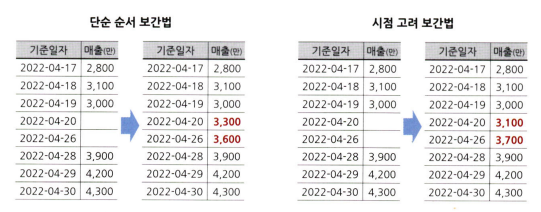

# 통계학 5주차 정규과제

📌통계학 정규과제는 매주 정해진 분량의 『*데이터 분석가가 반드시 알아야 할 모든 것*』 을 읽고 학습하는 것입니다. 이번 주는 아래의 **Statistics_5th_TIL**에 나열된 분량을 읽고 `학습 목표`에 맞게 공부하시면 됩니다.

아래의 문제를 풀어보며 학습 내용을 점검하세요. 문제를 해결하는 과정에서 개념을 스스로 정리하고, 필요한 경우 추가자료와 교재를 다시 참고하여 보완하는 것이 좋습니다.

5주차는 `2부. 데이터 분석 준비하기`를 읽고 새롭게 배운 내용을 정리해주시면 됩니다.


## Statistics_5th_TIL

### 2부. 데이터 분석 준비하기
### 11.데이터 전처리와 파생변수 생성


## Study Schedule

|주차 | 공부 범위     | 완료 여부 |
|----|----------------|----------|
|1주차| 1부 p.2~56     | ✅      |
|2주차| 1부 p.57~79    | ✅      | 
|3주차| 2부 p.82~120   | ✅      | 
|4주차| 2부 p.121~202  | ✅      | 
|5주차| 2부 p.203~254  | ✅      | 
|6주차| 3부 p.300~356  | 🍽️      | 
|7주차| 3부 p.357~615  | 🍽️      | 

<!-- 여기까진 그대로 둬 주세요-->

# 11.데이터 전처리와 파생변수 생성

```
✅ 학습 목표 :
* 결측값과 이상치를 식별하고 적절한 방법으로 처리할 수 있다.
* 데이터 변환과 가공 기법을 학습하고 활용할 수 있다.
* 모델 성능 향상을 위한 파생 변수를 생성하고 활용할 수 있다.
```

## 11.1. 결측값 처리
<!-- 새롭게 배운 내용을 자유롭게 정리해주세요. -->

```
결측치가 발생하는 특성에 따라 세 가지 종류로 구분됨:

1. 완전 무작위 결측(MCAR: Missing Completely at Random)
: 이름 그대로 순수하게 결측값이 무작위로 발생한 경우

    - 결측값을 포함한 데이터를 제거해도 편향(bias)이 거의 발생되지 않음

2. 무작위 결측(MAR: Missing at Random)
: 다른 변수의 특성에 의해 해당 변수의 결측치가 체계적으로 발생한 경우

    ex. 특정 체인점의 POS기기에 오류가 나서 해당 체인점의 매출 정보에 결측값이 많이 나타난 경우

3. 비무작위 결측(NMAR: Missing at Not Random)
: 결측값들이 해당 변수 자체의 특성을 갖고 있는 경우

    ex. 고객정보 데이터의 '고객 소득' 변수에서 결측값들 대부분이 소득이 적어 공개하기를 꺼려해서 발생한 경우
```

```
Easy way to process missing value:

1. 표본 제거 방법(Completes analysis)
: 결측값이 심하게 많은 변수를 제거하거나 결측값이 포함된 행(observations)을 제외하고 데이터 분석을 하는 것

    -  전체 데이터에서 결측값 비율이 10% 미만일 경우 이 방법을 자주 사용

2. 평균 대치법(Mean Imputation)
: 결측값을 제외한 온전한 값들의 평균을 구한 다음, 그 평균 값을 결측값들에 대치하는 것

위 두 가지 방법은 완전 무작위 결측이 아닌 경우 적절하지 않음
```

```
데이터가 시계열적 특성을 가지고 있을 경우 보간법(interpolation)을 사용하는 것이 효과적

1. 단순 순서 보간법
: 전 시점 혹은 다음 시점의 값으로 대치하거나 전 시점과 다음 시점의 평균 값으로 대치하는 방법을 사용하는 것

2. 시점 고려 보간법
: 시점 인덱스의 간격이 불규칙하거나 결측값이 두 번 이상 연달아 있을 때는 선형적인 수치 값을 계산해 보간하는 것

❗중요 Point❗
: 단순하게 평균값 등으로 대치하는 것에서 더 나아가 해당 변수와 다른 변수 사이의 관계성을 고려해 보다 합리적으로 결측값 처리
```


```
회귀 대치법(regression imputation)
: 회귀식을 이용하여 결측값을 추정

    ex. 만약 수입이 많아질수록 연령이 높아지는 상관관계를 가지고 있다면, 연 수입이 높으면 상대적으로 높은 연령을 추정하여 결측값을 대치하는 것

    - 단점
    : 결측된 변수의 분산을 과소 추정하는 문제를 가지고 있음

해결 방법:

1. 확률적 회귀대치법(stochastic regression imputation)
: 인위적으로 회귀식에 확률 오차항을 추가하여 변동성을 조정

    -  관측된 값들의 변동성만큼 결측값에도 같은 변동성을 추가해 주는 것
    -  여전히 어느 정도 표본오차를 과소 추정하는 문제를 가지고 있음

2. 다중 대치법(multiple imputation)
: 단순대치를 여러 번 수행하고 n 개의 가상 데이터를 생성하여 이들의 평균으로 결측값을 대치하는 방법

    - 다중대치법의 3가지 단계:

    1. 대치 단계(Imputations step): 가능한 대치 값의 분포에서 추출된 서로 다른 값으로 결측치를 처리한 n 개의 데이터셋 생성

    2. 분석 단계(Analysis step): 생성된 각각의 데이터셋을 분석하여 모수의 추정치와 표준오차 계산

    3. 결합 단계(Pooling step): 계산된 각 데이터셋의 추정치와 표준오차를 결합하여 최종 결측 대치값 산출

    - 유의점

    : 가상적 데이터는 5개 내외 정도만 생성해도 성능에 큰 문제가 없음
    다만, 결측값의 비율이 증가할수록 가상데이터도 많이 생성해야 검정력이 증가함
```


## 11.2. 이상치 처리
<!-- 새롭게 배운 내용을 자유롭게 정리해주세요. -->

```
이상치(outlier)

- 데이터의 모집단 평균 or 총합을 추정하는 것에 문제를 일으킴
- 분산을 과도하게 증가시켜 분석이나 모델링의 정확도를 감소시킴
```


```
오른쪽 그래프를 보면 좌측 상단의 이상치 하나가 포함됨으로 인해 회귀선의 경사가 왜곡된 걸 확인할 수 있음
-> 극단적인 값은 데이터 분석 모델의 예측력을 약화시키는 주요 원인이 됨

이상치 제거의 문제점
: 추정치의 분산은 감소하지만 실젯값을 과장하여 편향을 발생시킴

자주 사용하는 두 가지 이상치 처리 방법:

1. 관측값 변경(value modification)
: 하한 값과 상한 값을 결정한 후 하한 값보다 작으면 하한 값으로 대체
하고 상한 값보다 크면 상한 값으로 대체하는 방법

2. 가중치 조정(weight modification)
: 이상치의 영향을 감소시킬 수 있도록 가중치를 부여하는 방법

평균은 이상치에 민감하므로, 이상치에 보다 강건한 중위수와 중위수 절대 편차(MAD: Median Absolute Deviation)를 사용하는 것이 좀 더 효과적임
```

```
위 그래프처럼 의사 등 전문직이 포함되어 이처럼 분포에서 벗어난
수치가 존재한 것이라면, 분석 모델에 직종(사무직/전문직 등) 변수를 추가하여 회귀선의 정확도를 높일 수 있음
-> 이상치를 변수화하여 이상치에 대한 설명력을 추가하는 것
```

## 11.3. 변수 구간화
<!-- 새롭게 배운 내용을 자유롭게 정리해주세요. -->

```
변수 구간화(Binning)
: 데이터 분석의 성능을 향상시키기 위해 혹은 해석의 편리성을 위해 이산형 변수를 범주형 변수로 변환하는 것

- 클러스터링
 : 타깃 변수 설정 없이 구간화할 변수의 값들을 유사한 수준끼리 묶어줄 수 있음

- 의사결정나무
 : 타깃 변수를 설정해, 구간화할 변수의 값을 타깃 변수 예측에 가장 적합한 구간으로 나누어 줌

구간화 측정 방법:

1. WOE(Weight of Evidence)값
2. IV(Information Value)값
 - IV 수치가 높을수록 종속변수의 True와 False를 잘 구분할 수 있는 정보량이 많음을 의미
 - IV 값이 0.3보다 큰 경우 예측력이 우수한(Strong) 변수인 것으로 판단
```


## 11.4. 데이터 표준화와 정규화 스케일링
<!-- 새롭게 배운 내용을 자유롭게 정리해주세요. -->

```
스케일링
: 독립 변수들이 서로 단위가 다르거나 편차가 심할 때 값의 스케일을 일정한 수준으로 변환시켜주는 것
```

```
표준화
: 각 관측치의 값이 전체 평균을 기준으로 어느 정도 떨어져 있는지 나타낼 때 사용

- 평균은 0, 1표준편차 거리는 ±1, 2표준편차 거리는 ±2로 변환됨
- Zero-mean으로부터 얼마나 떨어져 있는지를 나타내기 때문에 이를 Z-score라 표현
```
### $$z = \frac{x-\mu}{\sigma}$$

```
정규화
: 데이터의 범위를 0부터 1까지로 변환하여 데이터 분포를 조정하는 방법
```
### $$x_{scaled} = \frac{x-x_{min}}{x_{max}-x_{min}}$$


```
표준화 v.s. 정규화:

- 표준화는 평균에서 얼마나 떨어져 있는지를 나타내기 때문에 가장 큰 값이 1이 될 수도 있고 3.5가 될 수도 있음

- 정규화는 가장 큰 값은 1, 가장 작은 값은 0으로 직관적으로 표현되지만, 특정 값이 평균으로부터 어느 정도 떨어져 있는지를 바로 알기 어려움

-> 표준화와 정규화는 다른 특성을 가지고 있으므로 **필요와 목적**에 따라 선택해야 함
```

```
RobustScaler
: 이상치에 민감한 표준화 & 정규화 방식의 단점을 보완한 스케일링 기법

- 데이터의 중앙값(Q2)을 0으로 잡고 Q1(25%)과
Q3(75%) 사분위수와의 IQR 차이를 1이 되도록 함 
```

```
표준화나 정규화는 k-Nearest Neighbor, 서포트 벡터 머신(SVM)과 같은 거리를 활용한 군집 분석에서 필수적임

이유: 관측치가 군집의 중심점 혹은 다른 관측치와 어느 정도로 거리가 떨어져 있는지 측정함으로써 군집을 나누는데 변수(차원)마다 스케일이 제각각 이면 군집이 제대로 분리될 수 없기 때문
```

## 11.5. 모델 성능 향상을 위한 파생 변수 생성
<!-- 새롭게 배운 내용을 자유롭게 정리해주세요. -->

```
파생변수(Derived variable)
: 원래 있던 변수들을 조합하거나 함수를 적용하여 새로 만들어낸 변수를 뜻함

- 데이터의 특성을 이용하여 분석 효율을 높이는 것이기 때문에 전체 데이터에 대한 파악이 중요할 뿐만 아니라 해당 비즈니스 도메인에 대한 충분한 이해가 수반되어야 함

- 기존의 변수를 활용해서 만들어 낸 변수이기 때문에 다중공선성 문제가 발생할 가능성이 높음
 -> 상관분석을 통해 변수 간의 상관성을 확인하고 상관성에 따라 파생변수를 그대로 사용할지, 기존 변수를 제외하고 파생변수만 사용할지 여부를 결정해야 함 
```

<br>
<br>

# 확인 문제

## 문제 1. 데이터 전처리

> **🧚 한 금융회사의 대출 데이터에서 `소득` 변수에 결측치가 포함되어 있다. 다음 중 가장 적절한 결측치 처리 방법은 무엇인가?**

> **[보기]   
1️⃣ 결측값이 포함된 행을 모두 제거한다.  
2️⃣ 결측값을 `소득` 변수의 평균값으로 대체한다.  
3️⃣ `연령`과 `직업군`을 독립변수로 사용하여 회귀 모델을 만들어 `소득` 값을 예측한다.  
4️⃣ 결측값을 보간법을 이용해 채운다.**

> **[데이터 특징]**     
    - `소득` 변수는 연속형 변수이다.  
    - 소득과 `연령`, `직업군` 간에 강한 상관관계가 있다.  
    - 데이터셋에서 `소득` 변수의 결측 비율은 15%이다.

```
정답: 3️⃣
```

## 문제 2. 데이터 스케일링

> **🧚 머신러닝 모델을 학습하는 과정에서, `연봉(단위: 원)`과 `근속연수(단위: 년)`를 동시에 독립변수로 사용해야 합니다. 연봉과 근속연수를 같은 스케일로 맞추기 위해 어떤 스케일링 기법을 적용하는 것이 더 적절한가요?**

<!--표준화와 정규화의 차이점에 대해 고민해보세요.-->

```
정답: 정규화
```

### 🎉 수고하셨습니다.