# 통계학 6주차 정규과제

📌통계학 정규과제는 매주 정해진 분량의 『*데이터 분석가가 반드시 알아야 할 모든 것*』 을 읽고 학습하는 것입니다. 이번 주는 아래의 **Statistics_6th_TIL**에 나열된 분량을 읽고 `학습 목표`에 맞게 공부하시면 됩니다.

아래의 문제를 풀어보며 학습 내용을 점검하세요. 문제를 해결하는 과정에서 개념을 스스로 정리하고, 필요한 경우 추가자료와 교재를 다시 참고하여 보완하는 것이 좋습니다.

6주차는 `3부. 데이터 분석하기`를 읽고 새롭게 배운 내용을 정리해주시면 됩니다.


## Statistics_6th_TIL

### 3부. 데이터 분석하기
### 12.통계 기반 분석 방법론


## Study Schedule

|주차 | 공부 범위     | 완료 여부 |
|----|----------------|----------|
|1주차| 1부 p.2~56     | ✅      |
|2주차| 1부 p.57~79    | ✅      | 
|3주차| 2부 p.82~120   | ✅      | 
|4주차| 2부 p.121~202  | ✅      | 
|5주차| 2부 p.203~254  | ✅      | 
|6주차| 3부 p.300~356  | ✅      | 
|7주차| 3부 p.357~615  | 🍽️      |

<!-- 여기까진 그대로 둬 주세요-->

# 12.통계 기반 분석 방법론

```
✅ 학습 목표 :
* 주성분 분석(PCA)의 개념을 설명할 수 있다.
* 다중공선성을 진단할 수 있다.
* Z-TEST와 T-TEST의 개념을 비교하고, 적절한 상황에서 검정을 설계하고 수행할 수 있다.
* ANOVA TEST를 활용하여 세 개 이상의 그룹 간 평균 차이를 검정하고, 사후검정을 수행할 수 있다.
* 카이제곱 검정을 통해 범주형 변수 간의 독립성과 연관성을 분석하는 방법을 설명할 수 있다.
```

## 12.1. 분석 모델 개요
<!-- 새롭게 배운 내용을 자유롭게 정리해주세요.-->

```
방법론은 크게 두 축으로 나눠짐:

1. 통계학에 기반한 통계 모델(Statistical models)
2. 인공지능에서 파생된 기계 학습(Machine learning)

차이점:

- 통계 모델은 모형과 해석을 중요하게 생각 & 오차와 불확정성을 강조
- 기계 학습은 대용량 데이터를 활용하여 예측의 정확도를 높이는 것을 중요하게 생각
```
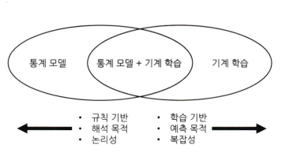

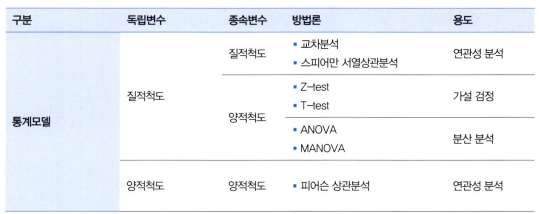

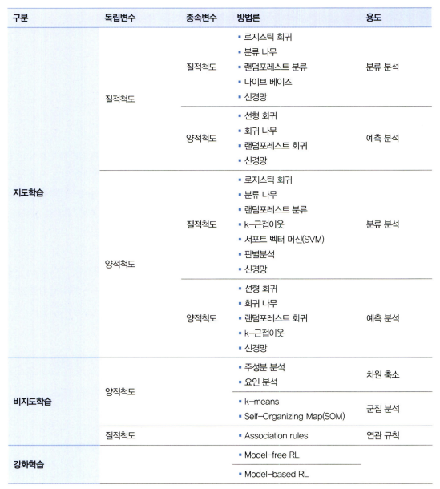

## 12.2. 주성분 분석(PCA)
<!-- 새롭게 배운 내용을 자유롭게 정리해주세요.-->

```
주성분 분석(Principal Component Analysis; PCA)

: 여러 개의 독립변수들을 잘 설명해 줄 수 있는 주된 성분을 추출하는 기법


- 변수들이 모두 등간 척도나 비율 척도로 측정한 양적변수여야 함
- 관측치들이 서로 독립적이고 정규분포를 이루고 있어야 함


차원을 감소하는 두 가지 방법:

1. 변수 선택을 통해 비교적 불필요하거나 유의성이 낮은 변수를 제거하는 방법
2. 변수들의 잠재적인 성분을 추출하여 차원을 줄이는 방법
 : 공통요인분석(Common Factor Analysis; CFA)이 이에 속한다. 

- PCA: 변수의 수를 축약하면서 정보의 손실을 최소화하고자 할 때 사용
- CFA: 변수들 사이에 존재하는 차원을 규명함으로써 변수듷 간의 구조를 파악하는 데 사용
```

- 차원의 저주

    ```
    : 변수가 늘어남에 따라 차원이 커지면서 분석을 위한 최소한의 필요 데이터 건수가 늘어나면서 예측이 불안정해지는 문제를 의미

    - 일반적으로 한 개의 변수(차원)에 30건의 데이터가 필요함
    - 변수가 늘어날수록 과적합(overfitting)의 위험성이 증가
    - 상관관계가 높은 변수로 인한 다중공선성 문제도 발생할 수 있어 많은 주의가 필요함
    ```

- PCA

    ```
    - 데이터 공간에 위치하는 점들의 분산을 최대한 보존하는 축을 통해 차원을 축소하는 것이 핵심
    - 데이터 표준화를 해주고 데이터의 분산을 가장 잘 나타낼 수 있는 축을 찾음
    - 변수의 개수만큼 주성분을 만들 수 있음

    주성분의 설명력?

    : 전체 분산 중에서 해당 주성분이 갖고 있는 분산이 곧 설명력

    - 각 주성분의 분산은 모든 포인트들과 주성분과의 거리의 제곱합을 n-1로 나누어서 구함
    
    ex. 제1주성분의 분산이 15이고, 제2주성분의 분산이 5라면?
    
    제1주성분의 설명력은 전체 분산인 20 중 15이므로 75%
    제2주성분은 나머지 25% 설명력을 갖게 됨
    ```
    $$\frac{SS(X_1,X_2,X_3...X_n)}{n-1}$$

## 12.4. 다중공선성 해결과 섀플리 밸류 분석
<!-- 새롭게 배운 내용을 자유롭게 정리해주세요.-->

```
다중공선성(multicollinearity)

: 두 개 이상의 독립변수가 서로 선형적인 관계를 나타낼 때 다중공선성이 있다고 말함

- 추정치의 통계적 유의성이 낮아져 모델의 정합성이 맞지 않는 문제가 발생
- 예측 성능이 과장되어 나올 수 있기 때문에 모델의 유의성을 판단하기 어려워짐
```
```
회귀분석 결과에서 독립변수들의 설명력을 의미하는 결정계수 R² 값은 크지만 회귀계수에 대한 값(t-value)이 낮다면 다중공선성을 의심해 볼 수 있음
 -> 각 계수 추정치의 표준오차가 크다는 것은 독립변수 간에 상관성이 크다는 것을 의미하기 때문

여기서 t-value란?

: 표준오차(노이즈) 대비 시그널을 뜻함, 값이 클수록 좋음
```
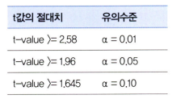

```
VIF(Variance Inflation Factor), 분산팽창계수

: 회귀분석 모델에 사용된 다른 독립 변수들이 해당 변수 대신 모델을 설명해 줄 수 있는 정도를 나타냄
```
$$VIF_k = (\frac{1}{1-R^2_k})$$

```
수식 해석

: 1에서 k번째 변수에 대한 다른 변수들의 설명력(R²)을 뺀 값을 분모로 하고 1을 분자로 한 값이 k번째 변수의 VIF값이 됨

- VIF값에 루트를 씌운 값은 해당 변수가 다른 변수들과의 상관성이 없는 경우보다 표준오차가 X배 높다는 것을 의미
 -> 표준오차가 높은 변수는 분석 모델의 성능을 저하시키므로 제거하는 것이 좋음
```
```
섀플리 밸류(Shapley Value)

: 각 독립변수가 종속변수의 설명력에 기여하는 순수한 수치를 계산하는 방법
```
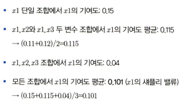

## 12.6. Z-test와 T-test
<!-- 새롭게 배운 내용을 자유롭게 정리해주세요.-->

```
Z-test, T-test, ANOVA:

- Z-test와 T-test: 두 집단 간의 평균 차이를
분석할 때 사용

- ANOVA: 두 집단 이상일 경우에 사용
```
```
Z-test와 T-test는 단일 표본 집단의 평균 변화를 분석하거나 두 집단의 평균값 혹은 비율 차이를 분석할 때 사용 

- 분석하고자 하는 변수가 양적 변수이며, 정규 분포이며, 등분산이라는 조건이 충족되어야 함

- 등분산 조건의 경우, bartlett 등분산성 검정을 통해 확인할 수 있음

- 등분산을 만족하면 equal variance t-test를 수행하고 만족하지 않으면 이분산이므로, Welch's t-test를 수행

Z-test와 T-test는 중에서 분석 방법을 선택하는 기준은?

: 모집단의 분산을 알 수 있는지와 표본의 크기에 따라 달라짐

- Z-test는 본래 모집단의 분산을 알 수 있는 경우에 사용
- 표본의 크기가 30 이상이면 중심 극한 정리에 의해 표본 평균분포가 정규분포를 따른다고 볼 수 있으므로 Z-test 사용이 가능
 -> 이러한 경우에는 Z-test와 T-test의 결과가 유사하게 나타남

- T-test는 표본의 크기가 30 미만이어서 표본 집단의 정규분포를 가정할 수 없을 때 사용됨
 -> 표본 집단의 크기가 30 이상일 때도 사용 가능하기 때문에 일반적으로 T-test를 사용
```
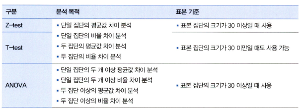

$$t_{stat} = \frac{\overline{X} - \mu}{\frac{S_X}{\sqrt{n}}}$$

- $\overline{X}$: 마케팅 적용 후의 매출 평균(표본 평균)
- $\mu$: 마케팅 적용 전의 매출 평균(귀무 가설에서의 모평균)
- $S_X$: 집단 값 차이의 표준 편차
- $n$: 표본 크기
```
- 평균의 차이가 클수록 표본의 수가 클수록 t값은 증가
- 관측치들의 값 간의 표준편차가 크면 평균의 차이가 불분명해지게 되고 t값은 감소
```

$$Z_{stat} = \frac{\overline{X} - \mu}{\frac{\sigma_X}{\sqrt{n}}}$$

- $\overline{X}$: 마케팅 적용 후의 매출 평균(표본 평균)
- $\mu$: 마케팅 적용 전의 매출 평균(귀무 가설에서의 모평균)
- $\sigma_X$: **마케팅 적용 전(모집단)의 표준 편차**
- $n$: 표본 크기
```
T-test에서 집단 값 차이의 표준 편차를 사용했던 것 대신 Z-test에서는 모집단의 표준편차를 사용
 ->  모집단의 분산을 알고 있다는 가정을 기반으로 Z 값을 계산하기 때문
```

**두 집단의 T-test 공식:**

$$t_{stat} = \frac{\overline{X}_A - \overline{X}_B - (\mu_A - \mu_B)}{\sqrt{\frac{S^2_A}{n_A} + \frac{S^2_B}{n_B}}}$$

- $\overline{X}_A$: A 집단의 평균
- $\overline{X}_B$: B 집단의 평균
- $\mu_A$: A 모집단의 평균(귀무가설의 추정 평균)
- $\mu_B$: B 모집단의 평균(귀무가설의 추정 평균)
- $S^2_A$: A 집단의 분산
- $S^2_B$: B 집단의 분산
- $n_A$: A 집단의 표본 수
- $n_B$: B 집단의 표본 수

```
두 집단 평균 차이 T-test의 귀무가설:

"집단 A와 B의 평균은 차이가 없다"

-> 두 집단 간의 평균 차이를 표준오차로 나누어 검정 통계량 값을 구하는 것
```

## 12.7. ANOVA
<!-- 새롭게 배운 내용을 자유롭게 정리해주세요.-->

```
ANOVA(Analysis of Variance)

- T 분포를 사용하는 T-test와는 달리 ANOVA는 F분포를 사용
- F검정의 통계값은 집단 간 분산의 비율을 나타냄
```

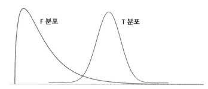
```
연속확률분포인 F분포:

- 두 모분산의 비교 및 검정을 위해 사용
- 항상 양의 값을 가지며 오른쪽으로 긴 꼬리 형태를 보임

ANOVA = 집단의 종류(독립변수)가 평균 값의 차이 여부(종속변수)에 미치는 영향을 검정

귀무가설: 독립변수(인자)의 차이에 따른 종속변수(특성 값)는 동일하다.

대립가설: 독립변수(인자)의 차이에 따른 종속변수(특성 값)는 다르다.

독립변수: 집단을 나타낼 수 있는 범주(분류)형 변수
종속 변수: 연속형 변수

독립변수와 종속변수의 형태에 따라 회귀분석이나 교차분석으로 분석 방법이 바뀜

- 회귀분석: 독립변수와 종속변수가 연속형일 때 사용
- 교차분석: 독립변수와 종속변수가 분류형일 때 사용
```
```
ANOVA

: 각 집단의 평균값 차이가 통계적으로 유의한지 검증

: 각 집단의 평균이 서로 멀리 떨어져 있어 집단 평균의 분산이 큰 정도를 따져서 집단 간 평균이 다른지를 판별

집단 내 분산 & 집단 간 평균의 분산 사용:

- 집단 내 분산
 : 집단 내의 각 관측치들이 집단 평균으로부터 얼마나 퍼져 있는지를 나타내는 분산
 
- 집단 간 평균의 분산
 : 전체 집단의 통합 평균과 각 집단의 평균값이 얼마나 퍼져 있는지를 나타냄
```
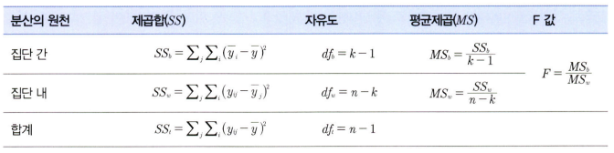
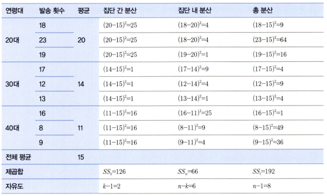

```
ANOVA 분산분석을 통해 통계적으로 유의미한 차이가 있다고 결론이 나왔어도, 이것만으로는 각 연령대의 평균이 모두 다른 것인지 일부만 다른 것인지 알 수 없음
 -> 이를 위해 사후(post hoc) 검증 진행

사후검증

: 독립변수 수준 사이에서 평균의 차이를 알고자 할 때 쓰이는 기법

- Turkey의 HSD 검증: 각 집단의 수가 같을 때 사용
- Scheffe 검증: 집단의 수가 다를 때 사용

이를 통해 유의수준 안의 부집단을 구별할 수 있음
```

## 12.8. 카이제곱 검정(교차분석)
<!-- 새롭게 배운 내용을 자유롭게 정리해주세요.-->

```
카이제곱 검정(Chi-square test) = 교차분석(Crosstab)

: 명목 혹은 서열척도와 같은 범주형 변수들 간의 연관성을 분석하기 위해 결합분포를 활용하는 방법

: 변수들간의 범주를 동시에 교차하는 교차표를 만들어 각각의 빈도와 비율을 통해 변수 상호 간의 독립성과 관
련성을 분석

- 상관분석과 달리 연관성의 정도를 수치로 표현할 수 없음
- 검정 통계량 카이 제곱(X²)을 통해 변수 간에 연관성이 없다는 귀무가설을 기각하는지 여부로 상관성이 있고 없음을 판단
```
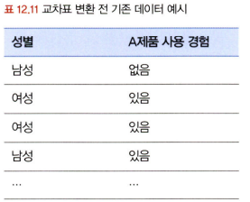

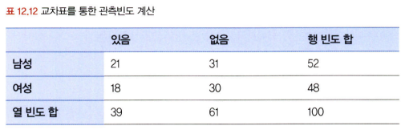

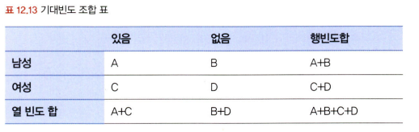

- A의 기대빈도: (A+B)(A+C)/(A+B+C+D)
- B의 기대빈도: (A+B)(B+D)/(A+B+C+D)
- C의 기대빈도: (C+D)(A+C)/(A+B+C+D)
- D의 기대빈도: (C+D)(B+D)/(A+B+C+D)

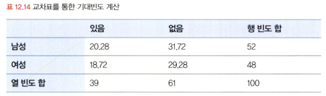

$$\frac{(실제빈도_{ij} - 기대빈도_{ij})^2}{기대빈도_{ij}}$$

<br>
<br>

# 확인 문제

### **문제 1.**
> **🧚 경희는 다트비 교육 연구소의 연구원이다. 경희는 이번에 새롭게 개발한 교육 프로그램이 기존 프로그램보다 학습 성취도 향상에 효과적인지 검증하고자 100명의 학생을 무작위로 두 그룹으로 나누어 한 그룹(A)은 새로운 교육 프로그램을, 다른 그룹(B)은 기존 교육 프로그램을 수강하도록 하였다. 실험을 시작하기 전, 두 그룹(A, B)의 초기 시험 점수 평균을 비교한 결과, 유의미한 차이가 없었다. 8주 후, 학생들의 최종 시험 점수를 수집하여 두 그룹 간 평균 점수를 비교하려고 한다.**   

> **🔍 Q1. 이 실험에서 사용할 적절한 검정 방법은 무엇인가요?**

```
T-test
```

> **🔍 Q2. 이 실험에서 설정해야 할 귀무가설과 대립가설을 각각 작성하세요.**

```
귀무가설: 그룹(A)와 그룹(B)의 평균 점수는 동일하다.
대립가설: 그룹(A)와 그룹(B)의 평균 점수에는 차이가 있다.
```

> **🔍 Q3. 검정을 수행하기 위한 절차를 순서대로 서술하세요.**

<!--P.337의 실습 코드 흐름을 확인하여 데이터를 불러온 후부터 어떤 절차로 검정을 수행해야 하는지 고민해보세요.-->

```
1. 정규성 검정 (Shapiro-Wilk Test 사용 가능)
 -> pvalue값이 0.05를 초과하면 정규성 만족
 -> 정규성을 만족하지 못하면 이상치 처리나 스케일링 등을 통해 정규성을 갖도록 가공해주어야 함 
 
2. 등분산성 검정
 -> pvalue값이 0.05를 초과하면 등분산

3. 대응표본 t검정 수행
4. 독립표본 t검정 수행

-> 검정 통계량 값을 통해 최종적으로 귀무가설 기각 여부를 판단
```

> **🔍 Q4. 이 검정을 수행할 때 가정해야 하는 통계적 조건을 설명하세요.**

```
분석하고자 하는 변수가 정규 분포이며 등분산이라는 조건을 충족해야 한다.
```

> **🔍 Q5. 추가적으로 최신 AI 기반 교육 프로그램(C)도 도입하여 기존 프로그램(B) 및 새로운 프로그램(A)과 비교하여 성취도 차이가 있는지 평가하고자 한다면 어떤 검정 방법을 사용해야 하나요? 단, 실험을 시작하기 전, C 그룹의 초기 점수 평균도 A, B 그룹과 유의미한 차이가 없었다고 가정한다.**

```
ANOVA 분산분석
```

> **🔍 Q6. 5번에서 답한 검정을 수행한 결과, 유의미한 차이가 나타났다면 추가적으로 어떤 검정을 수행해 볼 수 있을까요?**

```
사후 검증을 수행해 볼 수 있음
각 집단의 수가 같은지 다른지에 따라 사후 검증 기법이 나뉨
```

---

### **문제 2. 카이제곱 검정**  
> **🧚 다음 중 어떠한 경우에 카이제곱 검정을 사용해야 하나요?   
1️⃣ 제품 A, B, C의 평균 매출 차이를 비교하고자 한다.  
2️⃣ 남성과 여성의 신체 건강 점수 평균 차이를 분석한다.  
3️⃣ 제품 구매 여부(구매/미구매)와 고객의 연령대(10대, 20대, 30대…) 간의 연관성을 분석한다.  
4️⃣ 특정 치료법이 환자의 혈압을 감소시키는 효과가 있는지 확인한다.**  

```
3️⃣
```

### 🎉 수고하셨습니다.