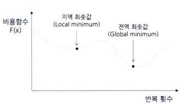
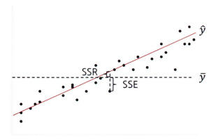
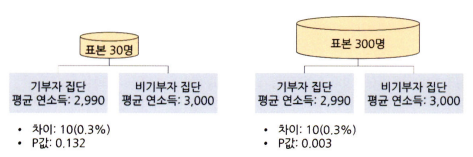

# 통계학 7주차 정규과제

📌통계학 정규과제는 매주 정해진 분량의 『*데이터 분석가가 반드시 알아야 할 모든 것*』 을 읽고 학습하는 것입니다. 이번 주는 아래의 **Statistics_7th_TIL**에 나열된 분량을 읽고 `학습 목표`에 맞게 공부하시면 됩니다.

아래의 문제를 풀어보며 학습 내용을 점검하세요. 문제를 해결하는 과정에서 개념을 스스로 정리하고, 필요한 경우 추가자료와 교재를 다시 참고하여 보완하는 것이 좋습니다.

7주차는 `3부. 데이터 분석하기`를 읽고 새롭게 배운 내용을 정리해주시면 됩니다.


## Statistics_7th_TIL

### 3부. 데이터 분석하기
### 13.머신러닝 분석 방법론
### 14.모델 평가


## Study Schedule

|주차 | 공부 범위     | 완료 여부 |
|----|----------------|----------|
|1주차| 1부 p.2~56     | ✅      |
|2주차| 1부 p.57~79    | ✅      | 
|3주차| 2부 p.82~120   | ✅      | 
|4주차| 2부 p.121~202  | ✅      | 
|5주차| 2부 p.203~254  | ✅      | 
|6주차| 3부 p.300~356  | ✅      | 
|7주차| 3부 p.357~615  | ✅      | 

<!-- 여기까진 그대로 둬 주세요-->

# 13.머신러닝 분석 방법론

```
✅ 학습 목표 :
* 선형 회귀와 다항 회귀를 비교하고, 데이터를 활용하여 적절한 회귀 모델을 구축할 수 있다. 
* 로지스틱 회귀 분석의 개념과 오즈(Odds)의 의미를 설명하고, 분류 문제에 적용할 수 있다.
* k-means 알고리즘의 원리를 설명하고, 적절한 군집 개수를 결정하여 데이터를 군집화할 수 있다.
```

## 13.1. 선형 회귀분석과 Elastic Net(예측모델)
<!-- 새롭게 배운 내용을 자유롭게 정리해주세요.-->
<!-- `13.1.3. Ridge와 Lasso 그리고 Elastic Net` 부분은 제외하고 학습하셔도 무방합니다.-->

- 13.1.1 회귀분석의 기원과 원리

    ```
    회귀 분석을 한 마디로 정의하면 "종속변수 Y의 값에 영향을 주는 독립변수 X들의 조건을 고려하여 구한 평균값"이라고 할 수 있음

    기본 조건:

    - 잔차의 정규성: X(독립변수)에 해당되는 Y(종속변수)의 값들의 잔차는 정규분포여야 함
    - 잔차의 등분산성: 잔차의 분산은 회귀 모형의 독립 변숫값과 상관없이 일정해야 함
    - 독립성: 독립변수들 간에 상관관계가 없어야 함(다중 선형회귀)
    - 선형성: X(독립변수) 값의 변화에 따른 Y(종속변수) 값의 변화는 일정해야 함
    ```

- 13.1.2 다항 회귀(Polynomial regression)

    ```
    다항회귀
    : 독립변수와 종속변수의 관계가 곡선형 관계일 때 변수에 각 특성의 제곱을 추가하여 회귀선을 곡선형으로 변환하는 모델을 의미
    
    - 차수가 커질수록 편향은 감소하지만 변동성이 증가
    - 분산이 늘어나고 과적합을 유발
    ```

## 13.2. 로지스틱 회귀분석 (분류모델)
<!-- 새롭게 배운 내용을 자유롭게 정리해주세요.-->

```
오즈
: 사건이 발생할 가능성이 발생하지 않을 가능성보다 어느 정도 큰지를 나타내는 값

발생 확률이 그렇지 않을 확률과 50:50으로 같다면 1.0, 두 배면 2.0, 다섯 배면 5.0이 됨

만약 발생 확률이 60%고 발생하지 않을 확률이 40%라면, 오즈는 1.5로 발생 확률이 1.5배 높다는 것을 의미
```
$$Odds = \frac{P(\text{event occuring})}{P(\text{event not occuring})} = \frac{P(\text{event occuring})}{1-P(\text{event occuring})}$$

## 13.8. k-means 클러스터링(군집모델)
<!-- 새롭게 배운 내용을 자유롭게 정리해주세요.-->

```
k-means 클러스터링 단계별 정리

- 1단계: k 개의 중심점을 임의의 데이터 공간에 선정
- 2단계: 각 중심점과 관측치들 간의 유클리드 거리를 계산
- 3단계: 각 중심점과 거리가 가까운 관측치들을 해당 군집으로 할당
- 4단계: 할당된 군집의 관측치들과 해당 중심점과의 유클리드 거리를 계산
- 5단계: 중심점을 군집의 중앙으로 이동(군집의 관측치들 간 거리 최소 지점)
- 6단계: 중심점이 더 이상 이동하지 않을 때까지 2~5단계 반복
```


# 14. 모델 평가

```
✅ 학습 목표 :
* 유의확률(p-value)을 해석할 때 주의할 점을 설명할 수 있다.
* 분석가가 올바른 주관적 판단을 위한 필수 요소를 식별할 수 있다.
```

## 14.3. 회귀성능 평가지표
<!-- 새롭게 배운 내용을 자유롭게 정리해주세요.-->

```
회귀모델의 회귀선이 종속변수 y값을 얼마나 잘 설명할 수 있는가를 의미
```

```
R-Square 값은 SSR 값이 클수록, SST 값이 작을수록 커짐
    
- SSR 값이 크다는 것은 회귀선이 각 데이터를 고르게 설명한다는 의미
- SST가 작다는 것은 SSR을 제외한 SSE가 작다는 의미
- SSE는 실젯값과 예측값의 차이이기 때문에, 당연히 작을수록 모델의 설명력이 높아짐
 ```

## 14.6. 유의확률의 함정
<!-- 새롭게 배운 내용을 자유롭게 정리해주세요.-->

```
p값은 표본의 크기가 커지면 점점 0으로 수렴하게 되는 특성이 있음 
 -> 표본의 크기가 커지면 표본 오차가 작아지고, 결과적으로 p값도 작아지게 되는 것

중요한 점:
"p값이 통계적 유의성을 확인하는 유용한 도구인 것은 맞지만, 연구나 분석의 가치를 평가하는 척도로 사용
되어서는 안 됨"
```


## 14.7. 분석가의 주관적 판단과 스토리텔링
<!-- 새롭게 배운 내용을 자유롭게 정리해주세요.-->
```
1차원적인 데이터는 사람들의 문화나 심리를 나타내지 못하는 경우가 많음

물론 분석가의 주관적 믿음과 판단으로 결과를 왜곡하거나 오류를 범할 수도 있음을 명시하고 주의해야 함

그러나 분석 시스템은 보이지 않는 요소를 고려하지 못하기 떄문에 분석가는 데이터를 항상 의심해야 함

올바른 주관적 판단을 하기 위해서는?

첫째, 해당 분야의 도메인 지식이 수반되어야 함
둘째, 통계적 지식을 기반으로 탐색적 데이터 분석과 데이터 전처리를 성실히 수행해야 함
셋째, 적극적인 커뮤니케이션과 검증 과정이 필요

데이터 분석의 스토리텔링
: "공감할 수 있는 문제를 어떻게 해결했는가가 핵심"

데이터 분석가의 업무는 데이터 수집, 가공, 분석뿐만 아니라 효과적인 결과 전달 과정까지 이뤄져야 비로소
완성됨
```

<br>
<br>

# 확인 문제

## **문제 1. 선형 회귀**

> **🧚 칼 피어슨의 아버지와 아들의 키 연구 결과를 바탕으로, 다음 선형 회귀식을 해석하세요.**  
> 칼 피어슨(Karl Pearson)은 아버지(X)와 아들(Y)의 키를 조사한 결과를 바탕으로 아래와 같은 선형 회귀식을 도출하였습니다. 아래의 선형 회귀식을 보고 기울기의 의미를 설명하세요. 
>  
> **ŷ = 33.73 + 0.516X**  
>   
> - **X**: 아버지의 키 (cm)  
> - **ŷ**: 아들의 예상 키 (cm)  

```
여기서 기울기 0.516이란 아버지의 키가 1cm 증가할 때 아들의 예상 키가 0.516cm 증가한다는 것을 의미함
```
---

## **문제 2. 다항 회귀**

> **🧚 선형 회귀와 비교하여 다항 회귀는 언제 사용할 수 있나요?**  

```
다항회귀는 선형 회귀과 달리 독립변수와 종속변수의 관계가 "곡선형" 관계일 때 사용할 수 있음

변수에 각 특성의 제곱을 추가하여 회귀선을 곡선형으로 변환하는 모델이기 때문
```
---

## **문제 3. 로지스틱 회귀**  

> **🧚 푸앙대학에서는 학생의 학업 성취도를 예측하기 위해 다항 로지스틱 회귀 분석을 수행하였습니다. 학업 성취도(Y)는 ‘낮음’, ‘보통’, ‘높음’ 3가지 범주로 구분되며, 독립 변수는 주당 공부 시간(Study Hours)과 출석률(Attendance Rate)입니다. 단, 기준범주는 '낮음' 입니다.**   

| 변수 | Odds Ratio Estimates | 95% Wald Confidence Limits |  
|------|----------------------|--------------------------|  
| Study Hours | **2.34** | (1.89, 2.88) |  
| Attendance Rate | **3.87** | (2.92, 5.13) |  

> 🔍 Q1. Odds Ratio Estimates(오즈비, OR)의 의미를 해석하세요.

<!--변수 Study Hours의 오즈비 값이 2.34라는 것과 Attendance Rate의 오즈비 값이 3.87이라는 것이 각각 무엇을 의미하는지 구체적으로 생각해보세요.-->

```
Study Hours
: 주당 공부 시간이 1시간 늘어나면, 학업 성취도가 보통이나 높음으로 바뀔 확률이 기준범주인 낮음으로 유지될 확률보다 2.34배 더 높음을 의미

Attendance Rate
: 출석률이 1% 증가할 때, 학업 성취도가 보통이나 높음으로 바뀔 확률이 기준범주인 낮음으로 유지될 확률보다 3.87배 더 높음을 의미

```

> 🔍 Q2. 95% Wald Confidence Limits의 의미를 설명하세요.
<!--각 변수의 신뢰구간에 제시된 수치가 의미하는 바를 생각해보세요.-->

```
95% Wald Confidence Limits는 해당 변수의 오즈비 추정값이 95% 확률로 이 범위 안에 있을 것을 의미

Study Hours(1.89, 2.88)
: 주당 공부 시간이 1시간 증가할 때, 학업 성취도가 보통 혹은 높음으로 바뀔 확률이 신뢰구간(1.89배에서 2.88배 증가)에 있음

Attendance Rate(2.92, 5.13)
: 출석률이 1% 증가할 때, 학업 성취도가 보통 혹은은 높음으로 바뀔 확률이 신뢰구간(2.92배에서 5.13배 증가)에 있음
```

> 🔍 Q3. 이 분석을 기반으로 학업 성취도를 향상시키기 위한 전략을 제안하세요.
<!--Study Hours와 Attendance Rate 중 어느 변수가 학업 성취도에 더 큰 영향을 미치는지를 고려하여, 학업 성취도를 향상시키기 위한 효과적인 전략을 구체적으로 제시해보세요.-->

```
출석률의 오즈비 3.87 > 주당 공부 시간의 오즈비 2.34
-> 출석률이 학업 성취도를 향상시키는 데 더 큰 영향을 미침

출석률을 높이기 위해서 일정 출석률 이상인 학생들에게 가산점 등 추가 혜택을 제공
```

---


## **문제 4. k-means 클러스터링**

> **🧚 선교는 고객을 유사한 그룹으로 분류하기 위해 k-means 클러스터링을 적용했습니다. 초기에는 3개의 군집으로 설정했지만, 결과가 만족스럽지 않았습니다. 선교가 최적의 군집 수를 찾기 위해 사용할 수 있는 방법을 한 가지 이상 제시하고 설명하세요.**

```
1. 엘보우 기법(Elbow method) 활용

엘보우 기법이란 군집 내 중심점과 관측치 간 거리 합이 급감하는 구간의 k 개수를 선정하는 방법

2. 실루엣 계수(Silhouette coefficient) 활용

실루엣 계수는 군집 안의 관측치들이 다른 군집과 비교해서 얼마나 비슷한지를 나타내는 수치
```

### 🎉 수고하셨습니다.